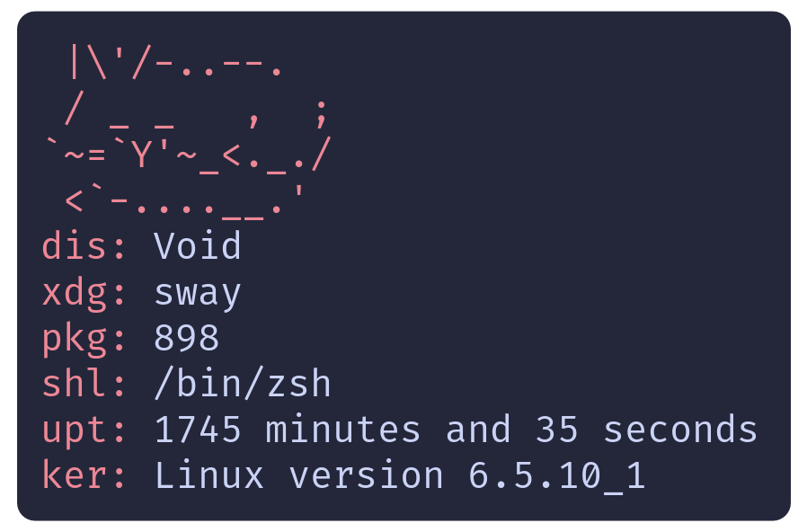

Archived: migrated to [Codeberg](https://codeberg.org/callyral/lowfetch)

# lowfetch



A Linux system information tool I made (so I could learn C)

## Goals

- Be as small as possible, without sacrificing features.

- Have no external dependencies (other than the standard library).

- Work on all/most Linux systems.

## Building

### Requirements

- [Make](https://www.gnu.org/software/make/)

- [clang](https://clang.llvm.org/) (default), [gcc](https://gcc.gnu.org/) or another C99 compiler.

- [mold](https://github.com/rui314/mold) linker

### Debug Requirements

- [gdb](https://www.gnu.org/software/gdb/)

### Guide

- Release: `make build`

- Debug (gdb): `make debug`

## Installing

Run `make build` then copy `build/lowfetch` somewhere in your `$PATH`, such as `/usr/local/bin/`

## Assumptions

Necessary assumptions for expected functionality.

- You run a Linux-based OS

- `/proc/version`, `/proc/uptime` and `/etc/os-release` exist.

- Either `$HOME` or `$XDG_CONFIG_HOME` are defined.

- Either `$XDG_CURRENT_DESKTOP` or `$XDG_SESSION_DESKTOP` are defined.

- `$SHELL` is defined.

- The first line in `/etc/os-release` is `NAME="distro name"`

- Your package manager is one of: dpkg, dnf, xbps or pacman.

## Configuration

This may change in the future to something like a single TOML, YAML or INI file.

The following files are located either in `$XDG_CONFIG_HOME/lowfetch/` or in `$HOME/.config/lowfetch/` as a fallback.

### ascii

Contains your custom ascii.

format: plaintext

default:

```
 |\'/-..--.
 / _ _   ,  ;
`~=`Y'~_<._./
 <`-....__.'
```

### order

Contains the output order.

format: custom

- a: ascii

- d: distro

- k: kernel

- p: package amount

- s: shell

- u: uptime

- x: xdg desktop (window manager or desktop environment)

default: `adxpsuk`

valid example: `adukxspax`

## Colors

The accent color can be changed using the --color option.

It's arguments may be anything that starts with:

- w: white (default)

- r: red

- g: green

- y: yellow

- b: blue

- m: magenta

- c: cyan
